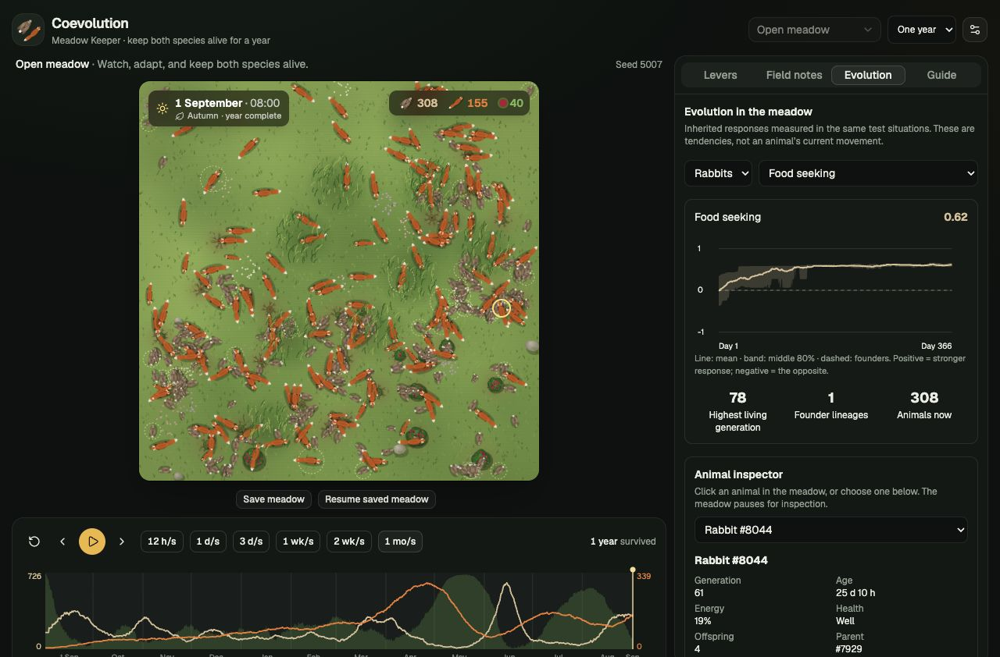

# Coevolution: Meadow Keeper

An evolving meadow that needs a keeper. Rabbits graze living berry bushes, foxes hunt
rabbits, and inherited controllers steer every animal. Watch the food supply, energy and
population trends, then intervene before either species disappears.

- **Play a full year or go Endless.** A challenge lasts 365 days (8,760 hours). Endless
  continues until extinction, with recurring seasons and a rolling year of replay.
- **Eight interventions, four uses.** Rain, plant bushes, release rabbits, release foxes,
  cull foxes, feed foxes, rabbit illness and fox illness. Illness spreads locally, drains
  energy and can overshoot; purple rings mark affected animals. An intervention applies at
  the hour on screen and shows at once, even while paused.
- **Watch evolution.** The Evolution page shows inherited trait distributions, generations,
  lineages and observed milestones. Click an animal to inspect its family, health and traits.
- **Keep a world.** Save/resume preserves animals, genes, food, random streams, intervention
  charges, the population graph and the last 15 days of replay in one device-local save slot.
- **Energy matters.** Movement, senses and metabolism cost energy. Hunting requires contact
  and hunger; deaths distinguish starvation, predation, age, illness and culling.
- **Readable time.** The clock and seasonal scenery remain, without day/night dimming.
  Default playback is one day per second. The meadow pauses when a new red field note
  appears (a switch turns this off), and the speed label says so when a crowded meadow runs
  slower than the chosen speed.

The starting meadow is intended to survive without help about 30–50% of the time. In the
50-seed Node validation, 18 survived (36%); Chrome 153 produced 23/50 (46%) on the same seeds.
Neither batch hit a population safety ceiling.
Adaptation is measured separately from ecosystem survival. See [the results and their
limitations](docs/validation.md), [game design](docs/game-design.md), [playtest](docs/playtest.md) and [roadmap](docs/roadmap.md).

Seeds choose the world and its random streams. Repeating a seed with the same settings and
interventions at the same hours repeats the outcome in the same runtime. Different seeds
produce different runs. Exact trajectories across browser/Node versions are not guaranteed.
Settings include a daily seed, shareable seed links and a practice meadow (seed 5007).



[Watch the recorded meadow demo](docs/media/meadow.webm).

## Run and check

Use a Node version supported by Vite 8 (validation used Node 25.2.1).

```bash
npm ci
npm run dev             # http://localhost:47321
npm test
npm run build           # TypeScript and production bundle
npm run lint
```

| Key | Action |
| --- | --- |
| Space | Play / pause |
| Left / right | Back / forward one day; Shift for one hour |
| Up / down | Change playback speed |
| Home / End | Earliest available replay / live |
| R | Reset run (asks first once the run is past a week) |

## Reproduce the experiments

These run the same pure simulation used by the game. Reports include individual seeds;
changing the preset changes the experiment, so retain the parameters with the results.

```bash
node --import tsx scripts/validate-balance.ts 5000 50 /tmp/balance.json
node --import tsx scripts/intervention-assay.ts 5000 50 /tmp/interventions.json
node --import tsx scripts/evo-assay.ts linear 20 --start 6000 --json /tmp/evolution.json
```

For the browser comparison, open `/scripts/browser-balance.html` on the development server.
It runs in a worker and offers a JSON report download.

The evolution assay uses independent founder opponents in fixed arenas. Its control samples
newborn genes from the original founder pool independently of successful parents. A third,
mutation-off condition still allows selection. Hidden brains, memory and structural growth
remain experimental assay variants, pending evidence of an advantage.

## Deployment and layout

GitHub Pages serves [the main branch deployment](https://jack-coutts.github.io/coevolution_game/).
The deployment workflow tests and builds pushes to `main`; feature branches do not deploy.
Production assets use `/coevolution_game/`, while development uses `/`.

```bash
npm run build
npx vite preview --base /coevolution_game/  # http://localhost:47322/coevolution_game/
```

| Path | Contents |
| --- | --- |
| `src/sim/` | Seeded simulation, inherited controllers, ecology and time |
| `src/worker/` | Simulation worker and compact frame/stat messages |
| `src/game/` | Playback, bounded history, saves, scores and field notes |
| `src/render/` | Canvas animals, vegetation and seasonal scenery |
| `src/components/` | Game controls, Evolution view and inspector |
| `tests/` | Determinism, ecology, illness, checkpoint and Endless checks |
| `scripts/` | Balance, intervention and controlled evolution experiments |
| `docs/experiments/` | Recorded validation data |
